# Manga Translator

Detects speech bubbles on a manga page, erases the original text, translates it,
and draws the translation back into the bubble.

Forked from [TareHimself/manga-translator](https://github.com/TareHimself/manga-translator).

## How it works

The page runs through six stages, in `translator/pipelines.py`:

| # | Stage | What it does |
|---|-------|--------------|
| 1 | Detection | [YOLOv8](https://github.com/ultralytics/ultralytics) finds speech bubbles and free text |
| 2 | Segmentation | A second YOLO model masks the text pixels inside them |
| 3 | Cleaning | [LaMa](https://github.com/advimman/lama) inpaints the text away |
| 4 | OCR | [manga-ocr](https://huggingface.co/TareHimself/manga-ocr-base) reads the original Japanese |
| 5 | Translation | DeepL or DeepSeek translates it |
| 6 | Drawing | PIL lays the translation out and draws it into the cleaned bubble |

Stages 3 to 6 are plugins. Each declares its own settings, and the web UI builds
its settings form from those declarations, so adding a backend means writing one
class and adding one line to the matching `get.py`.

Each stage deliberately carries one good backend rather than a menu. The
alternatives that used to be here — EasyOCR, Tesseract, DeepFillV2, OpenAI,
Gemini, Google Cloud, Helsinki-NLP — were either worse on manga specifically,
broken, or duplicated something that remains.

## Install

Requires Python 3.10 or newer.

### 1. System packages

None are required. Optionally, `sudo apt install python3-tk` enables the debug
image viewer; without it, `display_image()` writes a PNG to the working
directory instead.

On Ubuntu, installing
[Intel oneAPI Threading Building Blocks](https://www.intel.com/content/www/us/en/developer/articles/tool/oneapi-standalone-components.html#onetbb)
improves CPU inference performance.

### 2. Python dependencies

```bash
python3 -m venv .venv
source .venv/bin/activate
pip install -r requirements.txt
```

For CUDA, install the torch stack from the PyTorch index first, then the rest:

```bash
pip install torch torchvision --index-url https://download.pytorch.org/whl/cu121
pip install -r requirements.txt
```

### 3. Model weights

The weights are not in the repository. Download them into `models/`:

```bash
./scripts/fetch_models.sh
```

That fetches the two required models (~258 MB):

| File | Size | Used by |
|------|------|---------|
| `detection.pt` | 50 MB | Bubble and free-text detection |
| `segmentation.pt` | 208 MB | Text segmentation |

The LaMa cleaner and manga-ocr download their own weights the first time they
run, so they are not listed here.

## Usage

Commands are run from the repository root.

### CLI

```bash
python3 main.py -f image1.png image2.png   # a list of images
python3 main.py -f ./input                 # or a folder
```

Results are written to `output/`. `python3 main.py --help` lists the available
OCR, translator, drawer and cleaner backends with their index numbers, which is
what `-o`, `-t`, `-dr` and `-c` take. Each has a matching `-oa`, `-ta`, `-dra`
and `-ca` for that backend's settings, e.g. `-ca "dilation=15"` to erase more
aggressively.

`./run.sh` is a shortcut that creates the venv if needed, installs
dependencies, and converts everything in `./input`.

### Web UI

```bash
python3 server.py
```

Serves the interface on <http://localhost:5000>, where you can pick backends,
set their arguments, and compare the original against the result.

The UI is a React app in `ui/`. To rebuild it after changing the source:

```bash
cd ui && npm install && npm run build
```

### API keys

Both translation backends need credentials. The web UI has a field for them per
backend; `server.py` and `main.py` both read a `.env` file in the repository
root:

```
DEEPL_AUTH=...
DEEPSEEK_API_KEY=...
```

The `Custom Text` translator writes a fixed string into every bubble and needs
no key — useful for checking detection, cleaning and drawing on their own.

## Datasets

The detection and segmentation models were trained on these. The training
scripts and dataset converters are not in this repository — see the upstream
project if you want to retrain.

- [Detection](https://universe.roboflow.com/tarehimself/manga-translator-detection)
- [Segmentation](https://universe.roboflow.com/tarehimself/manga-translator-segmentation)

## Examples

Originals are in `examples/raw`, results in `examples/raw_converted`.

<table>
   <thead>
      <tr>
         <th align="center" width="50%">Original</th>
         <th align="center" width="50%">Translated</th>
      </tr>
   </thead>
   <tbody>
      <tr>
         <td align="center" width="50%">
            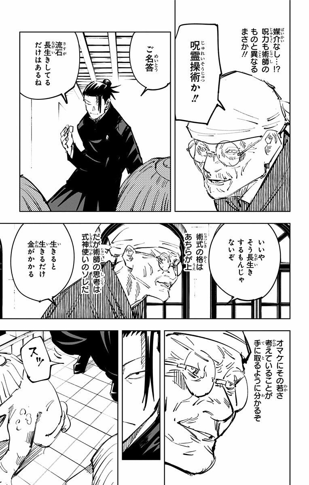
         </td>
         <td align="center" width="50%">
            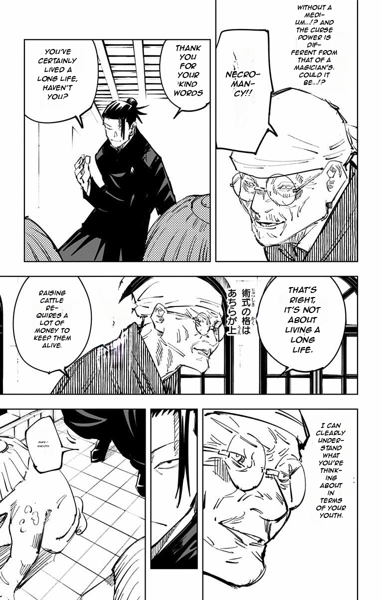
         </td>
      </tr>
      <tr>
         <td colspan=2 align="center">Japanese => English</br>Jujutsu Kaisen</td>
      </tr>
      <tr>
         <td align="center" width="50%">
            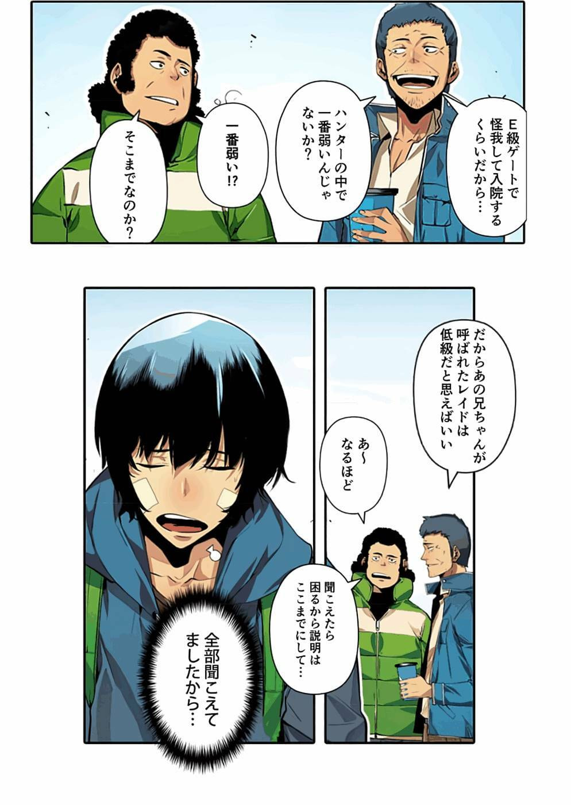
         </td>
         <td align="center" width="50%">
            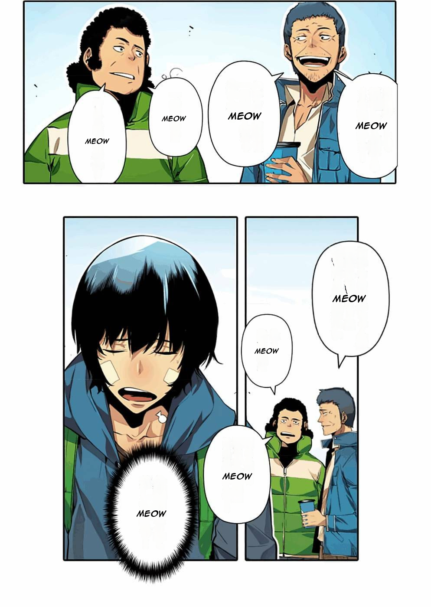
         </td>
      </tr>
      <tr>
         <td colspan=2 align="center">Japanese => "Meow"</br>Solo Leveling</td>
      </tr>
      <tr>
         <td align="center" width="50%">
            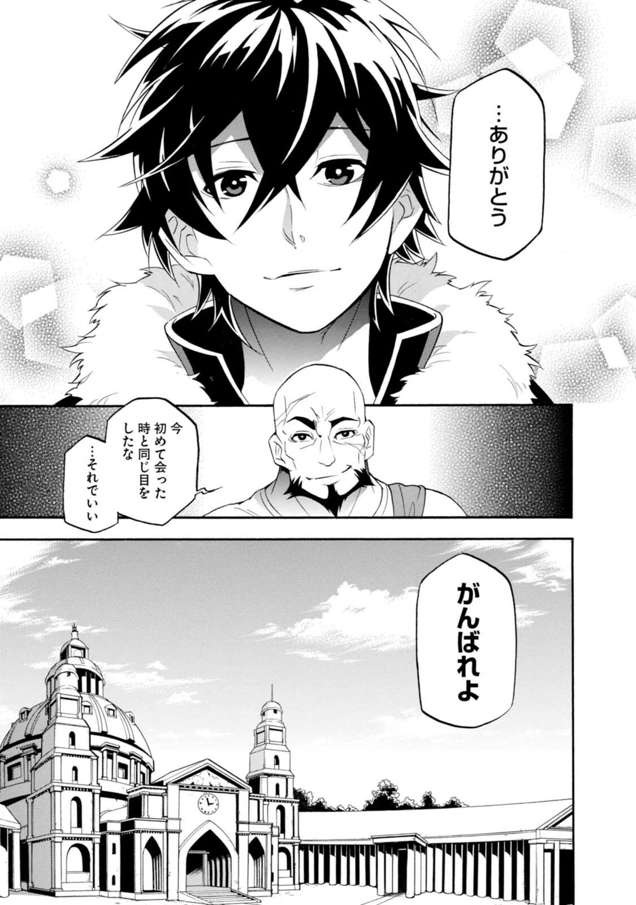
         </td>
         <td align="center" width="50%">
            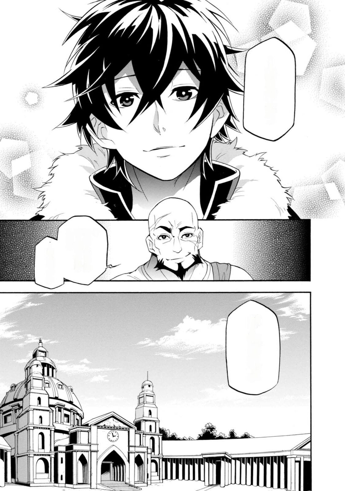
         </td>
      </tr>
      <tr>
         <td colspan=2 align="center">Japanese => Clean</br>The Rising of the Shield Hero</td>
      </tr>
      <tr>
         <td align="center" width="50%">
            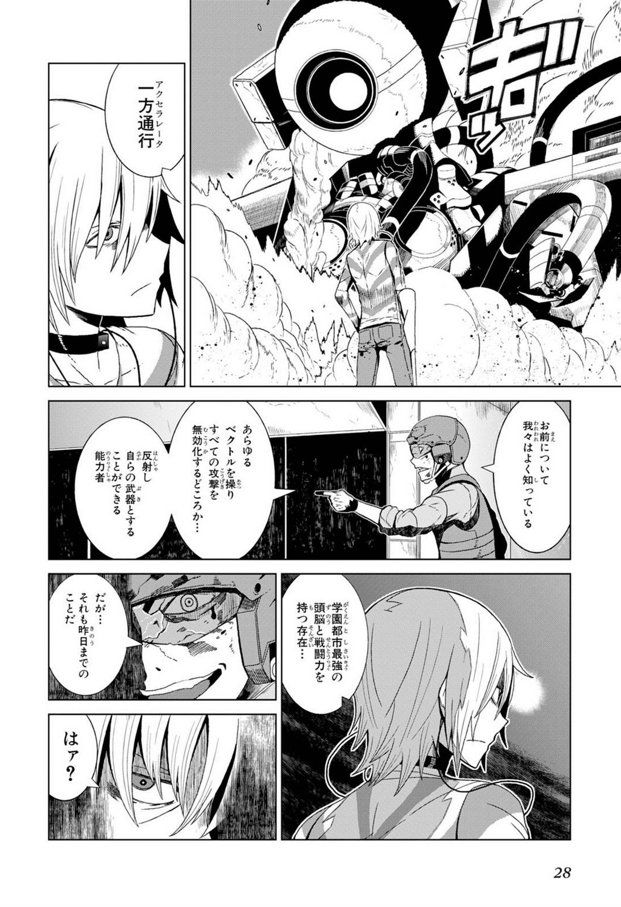
         </td>
         <td align="center" width="50%">
            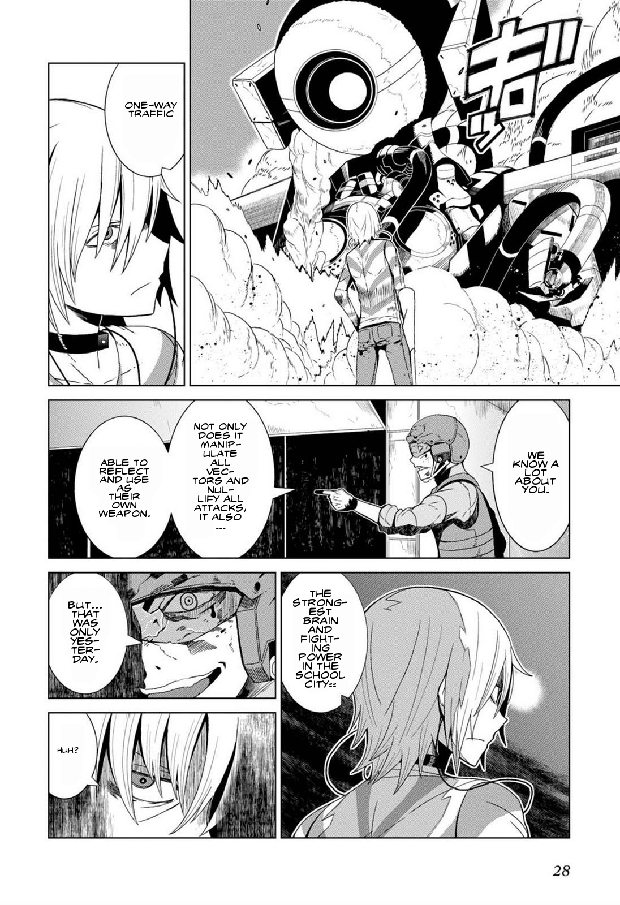
         </td>
      </tr>
      <tr>
         <td colspan=2 align="center">Japanese => English</br>A Certain Scientific Accelerator</td>
      </tr>
      <tr>
         <td align="center" width="50%">
            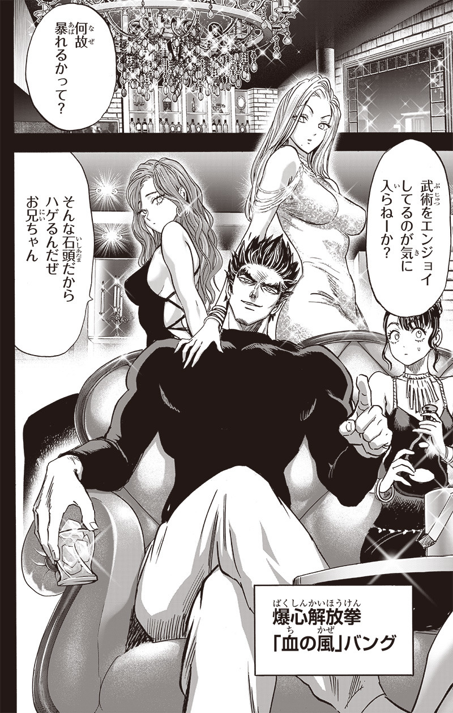
         </td>
         <td align="center" width="50%">
            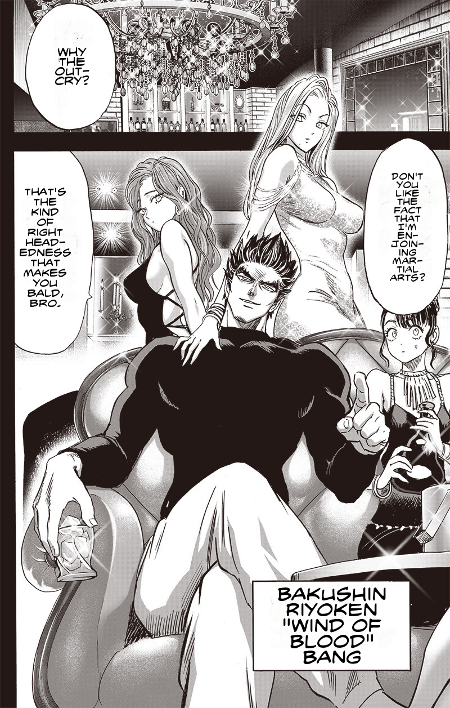
         </td>
      </tr>
      <tr>
         <td colspan=2 align="center">Japanese => English</br>One Punch Man</td>
      </tr>
      <tr>
         <td align="center" width="50%">
            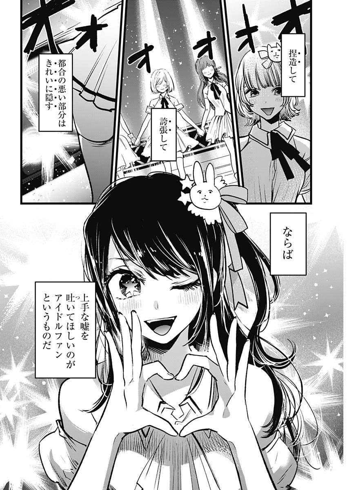
         </td>
         <td align="center" width="50%">
            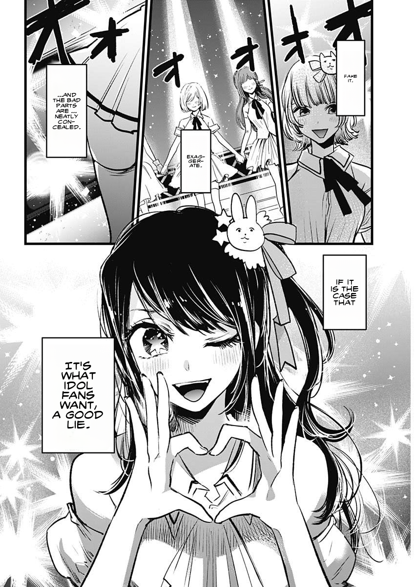
         </td>
      </tr>
      <tr>
         <td colspan=2 align="center">Japanese => English</br>Oshi No Ko</td>
      </tr>
   </tbody>
</table>

## Glossary

- **Bubble**: a speech bubble
- **Free text**: text found on pages but not in speech bubbles
- **Bubble text**: text within speech bubbles

## Status

Working:

- Bubble and free text detection
- Bubble text extraction, masking and inpainting
- OCR, translation, hyphenation and text insertion

Not working yet:

- Vertical text drawing
- Free text OCR and translation quality
- Text resize algorithm — some text comes out too large or too small

Removed rather than fixed: text colour detection (`translator/color_detect/`)
and the `VerticalDrawer` stub. Both were dead code; the git history has them if
either is ever picked back up.

## License

GPL-3.0. See [LICENSE](LICENSE).
